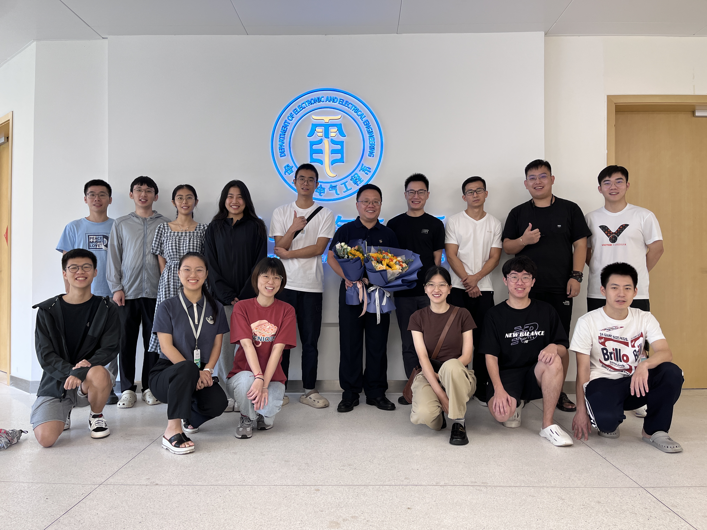
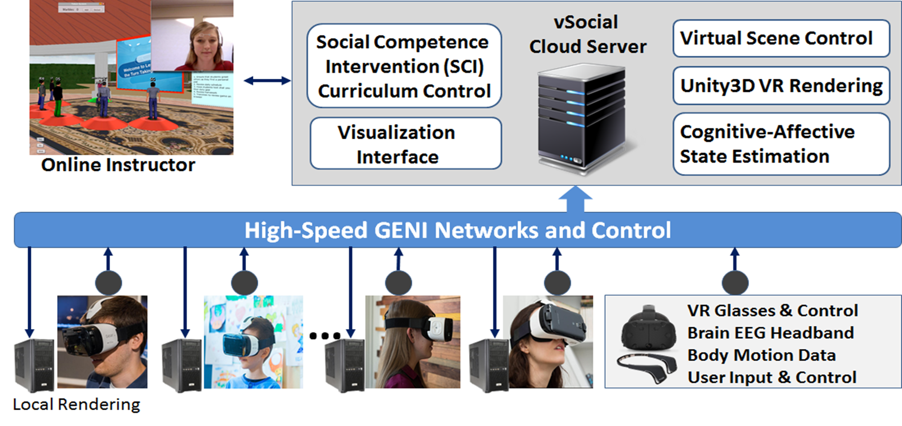

---
# Leave the homepage title empty to use the site title
title: research
date: 2022-10-24
type: landing

sections:
  - block: hero
    content:
      title: Primary Research Areas
      text: |
         
        <ul style="font-size:20px; width:1000px">
          <li>Intelligent sensor design, machine vision, multimodal perception of human behavior</li>
          <li>Big data intelligent analysis, machine learning, data fusion, data mining</li>
          <li>Large-scale data visualization</li>
          <li>Physiological function assessment</li>
          <li>Fall detection, AI disease monitoring, and early warning</li>
        </ul>

  - block: hero
    content:
      title: Research Group
      text: |
        

        <table style="width:1250px;height:380px">
        <tr>
        <td style="width:450px;"></td>
        <td style="width:700px">
        
The interdisciplinary research team established in the laboratory encompasses experts in various fields, including Dynamic Systems Sensing Communication - Analysis Modeling - Control Optimization and Machine Learning (Professor Zhihai He), Evolutionary Optimization (Associate Professor Ran Cheng), Data-Driven Partial Differential Equation Modeling and Computational Mathematics (Associate Professor Kailiang Wu), Fluid Dynamics (Professor Shidi Huang), and Cardiovascular Pathology (Professor Jinsong Bian). The research team also includes four postdoctoral researchers, eight research assistants, 10 doctoral candidates, and 14 master's candidates.
        
</td>
        </tr>
        </table>

  - block: hero
    content:
      title: Research Achievements
      text: |
        

        <table style="width:1250px;height:30px">
        <tr>
        <td style="width:500px">
        
Implemented a smart elderly care model based on the Internet of Things (IoT) and sensor-driven data analysis, leading to the generation of disease warnings. The research indicates that, within 2-4 weeks of disease onset, signs and patterns of common elderly diseases can be identified through the analysis of sensor data.
        

        
Laboratory Projects

        <ul style="font-size:20px">

        <li>National Natural Science Foundation of China (NSFC), Key Project:Theory and Methods of Screen Hybrid Content Coding Based on Multi-agent Collaborative Learning Duration: January 2024 to December 2028</li>

        <li>Horizontal Project: Research on 3D Display Optical Calibration and Image Quality Enhancement Methods(Subproject within the USTC-Huawei Photonics Industry Innovation Joint) Duration: January 2022 to December 2022</li>

        <li>Horizontal Project: Key Technology Research on Autonomous Navigation for Digital Tactile Paths Based on AI Collaborative Analysis Duration: June 2023 to May 2024</li>
        
        <li>Horizontal Project: Research Project on AI-based Home Care by Zhenny Technology in the Department of Electronic and Electrical Engineering Duration: November 2023</li>
        </td></ul>
        <td style="width:450px;">
        
        
        
        </td>
        </tr>
        </table>
        
        {}

        
  # - block: collection
  #   content:
  #     title: Latest News
  #     subtitle:
  #     text:
  #     count: 5
  #     filters:
  #       member: ''
  #       category: ''
  #       exclude_featured: false
  #       publication_type: ''
  #       tag: ''
  #     offset: 0
  #     order: desc
  #     page_type: post
  #   design:
  #     view: card
  #     columns: '1'
  
  # - block: markdown
  #   content:
  #     title:
  #     subtitle: ''
  #     text:
  #   design:
  #     columns: '1'
  #     background:
  #       image: 
  #         filename: coders.jpg
  #         filters:
  #           brightness: 1
  #         parallax: false
  #         position: center
  #         size: cover
  #         text_color_light: true
  #     spacing:
  #       padding: ['20px', '0', '20px', '0']
  #     css_class: fullscreen
  
  # - block: markdown
  #   content:
  #     title:
  #     subtitle:
  #     text: |
  #       {}
  #   design:
  #     columns: '1'
---