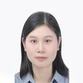

---
title: People
date: 2022-10-24
type: landing
sections:
  - block: people
    content:
      title: 
      # Choose which groups/teams of users to display.
      #   Edit `user_groups` in each user's profile to add them to one or more of these groups.
      user_groups:
          - Faculty
          - Ph.D. Students
          - Master Students
          - Undergraduates
          - Visiting Students
          - Graduate Students

      sort_by: Params.last_name
      sort_ascending: true
    design:
      show_interests: false
      show_role: true
      show_social: true

  # - block: hero
  #   design:
  #     background: 
  #       image: 
  #         filename: bg.png
  #   content:
  #     title: 
  #     text: |
  #        
  #       

  #       
Administrative Assistant

  #       
  #       
付辛

  #       
Xin Fu

  #       <a href="mailto:fux@mail.sustech.edu.cn" style="font-size:15px;text-decoration:none;top:-50%;margin-left:70%;">fux@mail.sustech.edu.cn</a>
  #       

  # - block: hero
  #   content:
  #     background:
  #     title: Research Group
  #     text: |
  #       

  #       <table style="width:1250px;height:380px">
  #       <tr>
  #       <td style="width:450px;"></td>
  #       <td style="width:700px">
  #       
The interdisciplinary research team established in the laboratory encompasses experts in various fields, including Dynamic Systems Sensing Communication - Analysis Modeling - Control Optimization and Machine Learning (Professor Zhihai He), Evolutionary Optimization (Associate Professor Ran Cheng), Data-Driven Partial Differential Equation Modeling and Computational Mathematics (Associate Professor Kailiang Wu), Fluid Dynamics (Professor Shidi Huang), and Cardiovascular Pathology (Professor Jinsong Bian). The research team also includes four postdoctoral researchers, eight research assistants, 10 doctoral candidates, and 14 master's candidates.
  #       
</td>
  #       </tr>
  #       </table>
---