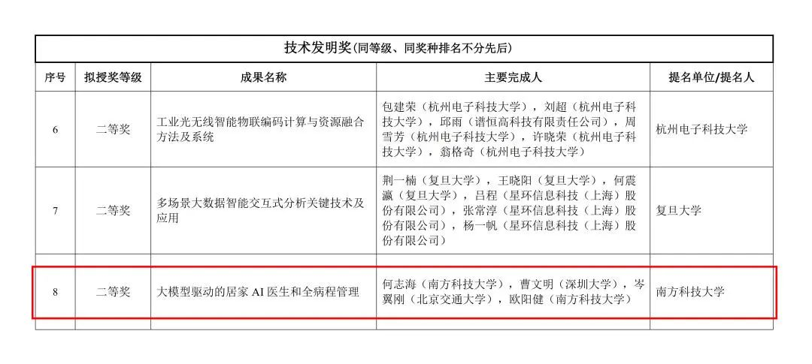
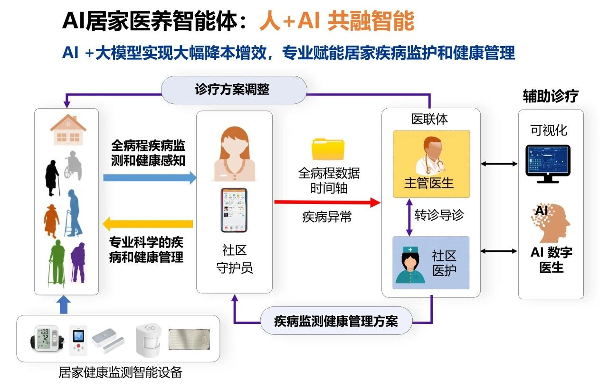

Recently, the list of winners of the 2024 Wu Wenjun Artificial Intelligence Science and Technology Award was officially released, and Professor He Zhihai Chair of the Department of Electrical and Electronic Engineering of the Southern University of Science and Technology (SUSTech), as the first project completion, stood out for his project of ‘Big Model-Driven Home AI Doctor and Total Patient Care Management’, which won the ‘Second Prize for Technological Invention of the Year 2024’. ‘The Second Prize for Technical Invention in the 2024 Wu Wenjun Artificial Intelligence Science and Technology Award.

Figure 1. Winners List.

Initiated by the Chinese Society for Artificial Intelligence, the Wu Wenjun Artificial Intelligence Science and Technology Award, known as ‘China's Highest Prize for Intelligent Science and Technology’, is a symbol of the highest honour in the field of artificial intelligence. The award aims to recognise units and individuals who have made key discoveries in AI research, promoted scientific and technological progress, and created significant economic and social benefits or ecological and environmental benefits.

Professor He Zhihai, together with Professor Cao Wenming of Shenzhen University, Professor Cen Yigang of Beijing Jiaotong University, and Senior Research Scholar Ouyang Jian of the Southern University of Science and Technology, jointly declared the achievement of ‘Big Model-Driven Home AI Doctor and Total Disease Management’, which is an innovative use of AI and big model technology to build a set of products that cover the following areas: home health and disease monitoring, analytical modelling, analysis and modelling, and home health and disease management. It innovatively uses artificial intelligence and big model technology to build a comprehensive platform covering home health and disease monitoring, analysis and modelling, early warning and intervention, diagnosis and treatment assistance, as well as chronic disease prevention and control management. The platform greatly empowers healthcare professionals to provide professional and intelligent health monitoring and disease management services for elderly patients with chronic diseases in the home environment, effectively solving the health monitoring and disease management problems brought about by aging.

Figure 2. AI home healthcare intelligent agent.

At present, the project has been successfully applied on a large scale in Guangdong, Hunan and Zhejiang, effectively improving the health management of local elderly patients with chronic diseases and generating good social benefits, and is expected to provide reference and demonstration for more regions to cope with the health challenges of aging.

Original link: <a href=https://mp.weixin.qq.com/s/K3X2Avrt6lgsTJWg3ry3Qw>https://mp.weixin.qq.com/s/K3X2Avrt6lgsTJWg3ry3Qw</a> 