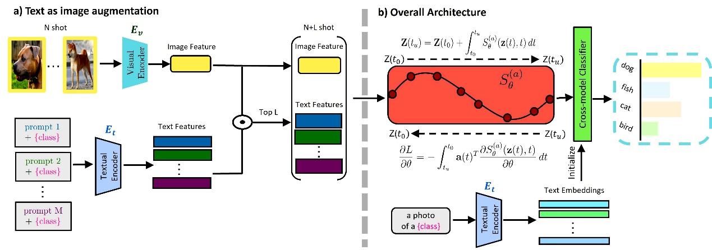

AAAI, short for The Association for Advancement of Artificial Intelligence, is one of the most important international conferences in the field of Artificial Intelligence, hosted by the International Association for Artificial Intelligence, and recommended by the Chinese Computer Federation (CCF) as a Class A conference. AAAI AAAI 2025 received 12,957 submissions and 3032 papers were accepted, with an acceptance rate of 23.4%, of which the Oral Presentation acceptance rate was 4.6%.AAAI 2025 was held on 25 February - 4 March 2025 in Philadelphia, Pennsylvania, USA.

**<u>《Cross-Modal Few-Shot Learning with Second-Order Neural Ordinary Differential Equations》</u>** 

**<u>Authors</u>** 
Yi Zhang (Harbin Institute of Technology, Southern University of Science and Technology), Chun-Wun Cheng (University of Cambridge), Junyi He (Southern University of Science and Technology), Zhihai He (Southern University of Science and Technology), Carola-Bibiane Schönlieb (University of Cambridge), Yuyan Chen (Fudan University), Angelica I Aviles-Rivero (Tsinghua University)

**<u>Brief introduction</u>** 
Yi Zhang, a PhD student in the class of 2021 at the Department of Electronic and Electrical Engineering, Southern University of Science and Technology, proposes an innovative method SONO in the field of cross-modal small-sample learning, which significantly improves the model's generalisation ability in few-sample scenarios through second-order God-frequent differential equations, and effectively solves the overfitting problem due to the scarcity of data in the traditional method.
With the rapid development of multimodal AI technology, how to make the model achieve cross-modal (e.g., image-text) efficient learning under a very small number of labelled samples has become a key challenge. Existing methods generally face bottlenecks such as high risk of overfitting, high consumption of computational resources, and insufficient cross-modal alignment capability. The research team innovatively introduces the second-order God's frequent differential equation into the cross-modal learning framework, enhances the model expression ability through continuous dynamic feature optimisation, and combines the ‘text-as-image’ data enhancement strategy to effectively expand the training data by using the graphic-text correlation feature of CLIP model. Experiments show that the classification accuracy of this method on 11 benchmark datasets, such as ImageNet, is significantly better than that of the existing optimal method for small samples, and shows potential application in data-scarce scenarios, such as medical images.

This paper is the result of research conducted by Yi Zhang, a PhD student from the Department of Electronics, SUSTech, class of 2021, during his visit to the University of Cambridge, UK, under the supervision of Professor Zhihai He Chair of SUSTech and Assistant Professor Angelica I. Aviles-Rivero, Tsinghua University Qiu Chengtong Mathematical Sciences Centre, during her tenure as a Senior Associate Researcher at the University of Cambridge, and in collaboration with the research institutes of SUSTech, the Cambridge University Department of Applied Department of Mathematics and Theoretical Physics, University of Cambridge, Tsinghua University's Chuchengtong Centre for Mathematical Sciences, Shanghai Key Laboratory of Data Science and other research institutions. Yi Zhang, a joint PhD candidate of SUSTech and Harbin Institute of Technology, is the first author of this paper, while Junhuan Zheng, a PhD student of Cambridge University, Junyi He, an undergraduate student of SUSTech in the class of 2021, Prof. Carola-Bibiane Schönlieb of Cambridge University, and Yuyan Chen, a PhD student of the Shanghai Key Laboratory of Data Science of Fudan University are the authors of this paper, as well as Zhi-Hai He, a chair professor of the Department of Electronics of SUSTech, Angelica I. Aviles-Rivero, Assistant Professor at the Qiu Chengtong Centre for Mathematical Sciences, Tsinghua University, are the corresponding authors of this paper. NUST doctoral student Yi Zhang and undergraduate student Jun He are also from Zhihai He's group.

Paper link: <a href=https://arxiv.org/abs/2412.15813>https://arxiv.org/abs/2412.15813</a> 
Funding information: This work was supported by the National Natural Science Foundation of China under Key Project No. 62331014.

**<u>《Conditional Latent Coding with Learnable Synthesized Reference for Deep Image Compression》</u>** 

**<u>Authors</u>** 
Siqi Wu (University of Missouri), Yinda Chen (University of Science and Technology of China), Dong Liu (University of Science and Technology of China), Zhihai He (Southern University of Science and Technology)

**<u>Brief introduction</u>** 
Siqi Wu, a PhD student in the Department of Electrical and Computer Engineering, University of Missouri, USA, class of 2022, has proposed a conditional latent coding method based on learnable synthetic references to improve the efficiency of deep image compression in collaboration with the University of Science and Technology of China (USTC) during his visit to Southern University of Science and Technology (SUSTech) as a visiting researcher.

With the rapid development of digital technology and the dramatic increase in the amount of image data, efficient image compression techniques are crucial for storing, transmitting and processing image data. Current deep learning methods have made significant progress in image compression, but still face the challenge of effectively exploiting image source correlation while maintaining high reconstruction quality. The article proposes a conditional latent coding method to conditionally encode the input image by dynamically generating a reference representation from an external dictionary. The input image will be matched with the features in the dictionary to exploit the correlation between the input image and the reference dictionary in order to achieve efficient compression and high quality reconstruction of the input image. This thesis achieves a large enhancement on the publicly available datasets Kodak and CLIC, providing useful insights for further research and potential improvements.

Siqi Wu, a PhD student from the University of Missouri, class of 2022, is currently conducting visiting research in Zhihai He's group as a visiting student at the Southern University of Science and Technology (SUSTech) in the U.S.A. She is the co-first author of this paper together with Yinda Chen, a PhD student from the University of Science and Technology of China, class of 2024. Dong Liu, a professor in the Department of Electrical Engineering and Information Science at the University of Science and Technology of China (USTC), is the author of this paper, and Zhihai He, a chair professor in the Department of Electronics at USTC, is the corresponding author of this paper. The University of Missouri is the first unit of the paper, and Southern University of Science and Technology is the third unit of the paper.

Paper link: <a href=https://arxiv.org/abs/2502.09971v1>https://arxiv.org/abs/2502.09971v1</a> 
Funding information: This work was supported by the National Natural Science Foundation of China under Key Project No. 62331014.