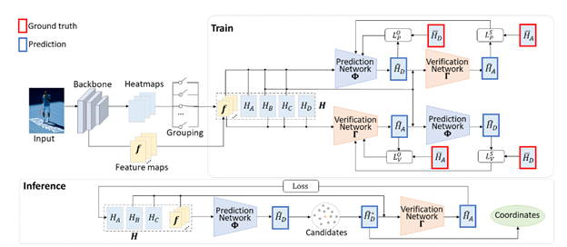
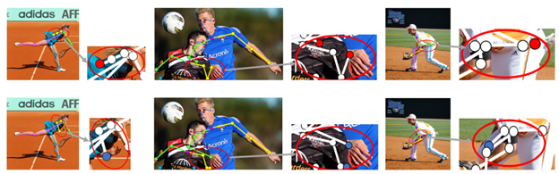

**<u>Context for the reader</u>** 
Human pose estimation aims to correctly detect and localize keypoints, i.e., human body joints or parts. It is one of the fundamental computer vision tasks which plays an important role in a variety of downstream applications, such as motion capture, activity recognition and person tracking. With the advent of the XR era, technologies such as virtual reality (VR), human-computer interaction (HCI), and augmented reality (AR) have gradually matured. As a core part in XR research, it is becoming more and more important to reach accurate estimation of human pose. However, due to free-style motion of human bodies, for complex scenes with person-person occlusions, large variations of appearance and texture, and cluttered backgrounds, pose estimation remains very challenging.

**<u>Authored researchers and journal details</u>** 
Chair Professor Zhihai He’s team from the Department of Electronic and Electrical Engineering (EEE) at the Southern University of Science and Technology (SUSTech) 
European Conference on Computer Vision (ECCV 2022), a top conference in computer vision with the proceedings published by Springer Science+Business Media, 
entitled “Self-Constrained Inference Optimization on Structural Groups for Human Pose Estimation.”

**<u>Findings & Conclusion</u>** 
Prof. He’s team observed that human poses exhibit strong group-wise structural correlation and spatial coupling between keypoints due to the biological constraints of different body parts. Based on this observation, researchers propose to partition the body keypoints into structural groups. Within each group, the keypoints are further partitioned into two subsets, proximal keypoints with high estimation accuracy and low-accuracy distal keypoints. This group-wise structural correlation can be explored to improve the accuracy and robustness of human pose estimation. 

Figure 1. Illustration of the proposed idea of self-constrained inference optimization of structural groups for human pose estimation.

One fundamental challenge in pose estimation, as well as in generic prediction tasks, is that there is no mechanism for us to verify if the obtained pose estimation or prediction results are accurate or not, since the ground truth is not available. Prof. He’s team developed a self-constrained prediction-verification network to perform forward and backward predictions between these keypoint subsets. In Figure 2, This prediction-verification network with a forward-backward prediction loop learns the internal structural correlation between the proximal keypoints and the distal keypoint. The learning process is guided by the self-constraint loss. If the internal structural correlation is successfully learned, then the self-constraint loss generated by the forward and backward prediction loop should be small. This step is referred to as self-constrained learning. 

Figure2. The overall framework of the proposed network.

Once successfully learned, the verification network serves as an accuracy verification module for the forward pose prediction. During the inference stage, it can be used to guide the local optimization of the pose estimation results of low-accuracy keypoints with the self-constrained loss on high-accuracy keypoints as the objective function. This provides an effective mechanism to iteratively refine the prediction result based on the specific statistics of the test sample. This step is referred to as self-constrained optimization. Such feedback-based adaptive prediction will result in better generalization capability on the test sample. 

The comparison and ablation experiments are performed on MS COCO dataset and CrowdPose dataset, both of which contain very challenging scenes for pose estimation such as multi-person poses of various body scales and occlusion patterns. The proposed method outperforms the current best by a large margin, up to 2.5% on MS COCO dataset. On CrowdPose dataset, it has improved the pose estimation accuracy by up to 1.5%, which is quite significantly. Visualization results in Figure 3 also demonstrate that the proposed method can significantly improve the pose estimation results.

Figure 3. Three examples of refinement of predicted keypoints. The top row is the original estimation. The bottom row is the refined version by the proposed method.

**Conclusion** 
In this work, reaserchers partition the body keypoints into structural groups exploring the structural correlation within each group and develop a prediction-verification network to characterize structural correlation between them based on a self-constraint loss. A self-constrained optimization method was introduced which uses the learned verification network as a performance assessment module to optimize the pose estimation of distal keypoints during the inference stage where the ground truth is not available. The extensive experimental results on benchmark MS COCO datasets demonstrated that the proposed SCIO method is able to significantly improve the pose estimation results, providing important reference value for follow-up research.

**<u>Authors of the original paper</u>** 
Master student Zhehan Kan of the Department of Electronic and Electrical Engineering (EEE) at SUSTech is the first author. Master student Shuoshuo Chen of the Department of Electronic and Electrical Engineering (EEE) at SUSTech and Associate Professor Zeng Li of Department of Statistics and Data Science are authors of this paper. Chair Professor Zhihai He of Electronic and Electrical Engineering (EEE) at SUSTech is the corresponding author. 

**<u>Supporting organizations</u>** 
Zeng Li’s research is partially supported by the National Natural Science Foundation of China NSFC (No. 12031005 and No. 12101292)

**<u>Any other recommendations </u>** 
Paper link: <u>https://arxiv.org/abs/2207.02425</u>