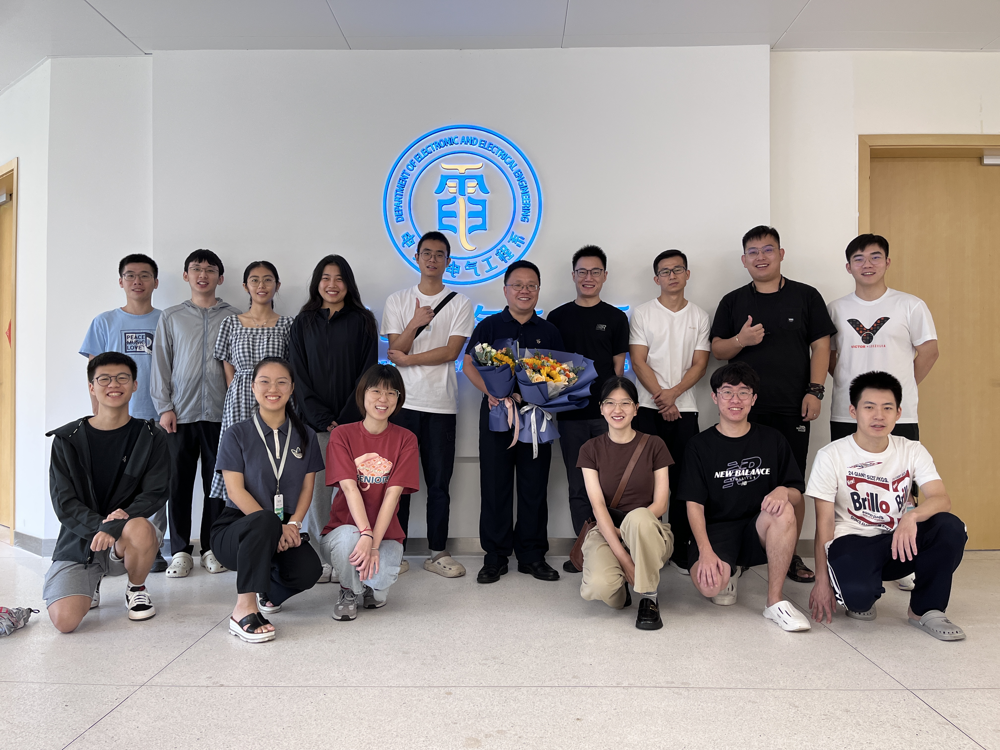
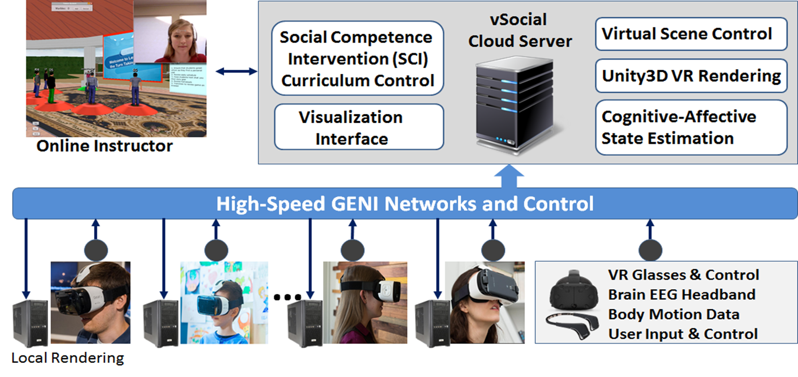

---
# Leave the homepage title empty to use the site title
title: 研究
date: 2022-10-24
type: landing

sections:
  - block: hero
    content:
      title: 主要研究方向
      text: |
         
        <ul style="font-size:20px; width:1000px">
          <li>智能感应器设计、机器视觉、人体行为多模态感知</li>
          <li>大数据智能分析、机器学习、数据融合、数据挖掘</li>
          <li>大规模数据可视化</li>
          <li>生理机能评估</li>
          <li>跌倒监测、AI疾病监测和预警等</li>
        </ul>

  - block: hero
    content:
      title: 研究团队
      text: |
        

        <table style="width:1250px;height:380px">
        <tr>
        <td style="width:450px;"></td>
        <td style="width:700px">
        
南科大人工智能实验室由何志海教授带头组建，研究方向有智能感应器设计、机器视觉、人体行为多模态感知；大数据智能分析、机器学习、数据融合、数据挖掘；大规模数据可视化；生理机能评估；跌倒监测、AI疾病监测和预警等。研究团队包括博士后1人，在读博士生5人，在读硕士生9人，本科生6人。南科大人工智能实验室致力于空间结构化推理和新一代深度学习；面向物联网的网络化分布式深度学习；深度智能人机交互系统研究，实现基于物联网智慧养老护理模型及基于感应器的数据分析，产生疾病预警。
        
</td>
        </tr>
        </table>
  - block: hero
    content:
      title: 研究成果
      text: |
        

        <table style="width:1250px;height:30px">
        <tr>
        <td style="width:700px">
        
实现基于物联网智慧养老护理模型及基于感应器的数据分析，产生疾病预警。研究表明，疾病发生2-4周，可以通过感应器数据的分析，发现常见老年人疾病发生的征兆和模式。
        

        
实验室项目

        <ul style="font-size:20px">

        <li>国家自然科学基金（NSFC），重点项目：基于多智能体协同学习的屏幕混合内容编码理论与方法 
        时间: 2024-01至2028-12</li>

        <li>横向课题：3D显示光学校正和图像质量增强方法研究（科大-华为光子产业创新联合实验室子课题） 时间: 2022-01至2022-12</li>

        <li>横向课题：基于AI协同分析的数字盲道自主导航关键技术研究 
        时间: 2022-01至2022-12</li>
        
        <li>横向课题：电子与电气工程系臻益科技AI居家养老研究项目 
        时间: 2023-11</li>
        </td></ul>
        <td style="width:450px;">
        
        
        </td>
        </tr>
        </table>
        
        {}

        
  # - block: collection
  #   content:
  #     title: Latest News
  #     subtitle:
  #     text:
  #     count: 5
  #     filters:
  #       member: ''
  #       category: ''
  #       exclude_featured: false
  #       publication_type: ''
  #       tag: ''
  #     offset: 0
  #     order: desc
  #     page_type: post
  #   design:
  #     view: card
  #     columns: '1'
  
  # - block: markdown
  #   content:
  #     title:
  #     subtitle: ''
  #     text:
  #   design:
  #     columns: '1'
  #     background:
  #       image: 
  #         filename: coders.jpg
  #         filters:
  #           brightness: 1
  #         parallax: false
  #         position: center
  #         size: cover
  #         text_color_light: true
  #     spacing:
  #       padding: ['20px', '0', '20px', '0']
  #     css_class: fullscreen
  
  # - block: markdown
  #   content:
  #     title:
  #     subtitle:
  #     text: |
  #       {}
  #   design:
  #     columns: '1'
---