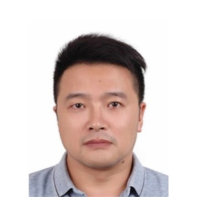
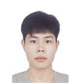

---
title: People
date: 2022-10-24
type: landing
sections:
  - block: people
    content:
      title: 
      # Choose which groups/teams of users to display.
      #   Edit `user_groups` in each user's profile to add them to one or more of these groups.
      user_groups:
          - 教师
          - 博士后
          - 博士在读
          - 硕士在读
          - 本科在读
          - 访问学生
          - 毕业学生

      sort_by: Params.last_name
      sort_ascending: true
    design:
      show_interests: false
      show_role: true
      show_social: true

  # - block: hero
  #   design:
  #     spacing:
  #       padding: ['0','0','0','0']
  #     background: 
  #       image: 
  #         filename: bg.png

  #   content:
  #     title: 
  #     text: |
  #       <meta name="viewport" content="width=device-width, initial-scale=1.0">

  #       
  #       

  #       

其他成员

  #       

  #         

  #             

  #             
欧阳健

  #             
Jian Ouyang

  #             
高级研究学者

  #             <a href="mailto:ouyj@mail.sustech.edu.cn" style="font-size:0.7rem;text-decoration:none;text-align: center;">ouyj@mail.sustech.edu.cn</a>
  #         

  #         

  #             

  #             
吴昊

  #             
Hao Wu

  #             
研究学者

  #             <a href="mailto:wuh3@mail.sustech.edu.cn" style="font-size:0.7rem;text-decoration:none;text-align: center;">wuh3@mail.sustech.edu.cn</a>
  #         

  #         

  #             

  #             
王璐峰

  #             
Lufeng Wang

  #             
算法工程师

  #             <a href="mailto:wanglf@mail.sustech.edu.cn" style="font-size:0.7rem;text-decoration:none;text-align: center;">wanglf@mail.sustech.edu.cn</a>
  #         

  #         

  #             

  #             
李广

  #             
Guang Li

  #             
算法工程师

  #             <a href="mailto:1451513175@qq.com" style="font-size:0.7rem;text-decoration:none;text-align: center;">1451513175@qq.com</a>
  #         

          
  #         

  #             

  #             
付辛

  #             
Xin Fu

  #             
行政助理

  #             <a href="mailto:fux@mail.sustech.edu.cn" style="font-size:0.7rem;text-decoration:none;text-align: center;">fux@mail.sustech.edu.cn</a>
  #         

          
  #         

  #             

  #             
吉睿雅

  #             
Ruiya Ji

  #             
科研助理

  #             <a href="mailto:jiry@mail.sustech.edu.cn" style="font-size:0.7rem;text-decoration:none;text-align: center;">jiry@mail.sustech.edu.cn</a>
  #       

  #       

  #       

---