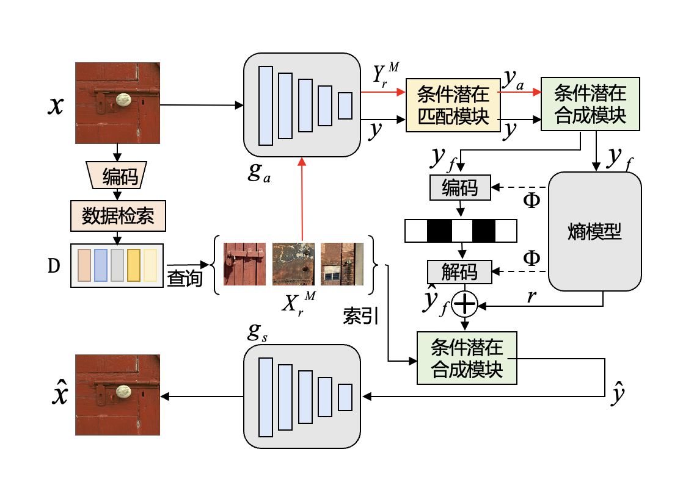

AAAI，即The Association for Advancement of Artificial Intelligence（国际人工智能协会）的简称，是人工智能领域最重要的国际会议之一，由国际人工智能协会主办，是中国计算机学会（CCF）推荐的A类会议。AAAI 2025共收到12,957份投稿，3032篇论文被录用，录取率为23.4%，其中Oral Presentation（口头报告）接收率为4.6%。AAAI 2025于2025年2月25日- 3月4日在美国宾夕法尼亚州费城举办。

**<u>《Cross-Modal Few-Shot Learning with Second-Order Neural Ordinary Differential Equations》</u>** 

**<u>作者</u>** 
Yi Zhang (Harbin Institute of Technology, Southern University of Science and Technology), Chun-Wun Cheng (University of Cambridge), Junyi He (Southern University of Science and Technology), Zhihai He (Southern University of Science and Technology), Carola-Bibiane Schönlieb (University of Cambridge), Yuyan Chen (Fudan University), Angelica I Aviles-Rivero (Tsinghua University)

**<u>简介</u>** 
南方科技大学电子与电气工程系2021级博士研究生张毅在跨模态小样本学习领域提出创新性方法SONO，通过二阶神经常微分方程显著提升模型在少样本场景下的泛化能力，有效解决了传统方法中因数据稀缺导致的过拟合问题。
随着多模态人工智能技术的快速发展，如何让模型在极少量标注样本下实现跨模态（如图像-文本）高效学习成为关键挑战。现有方法普遍面临过拟合风险高、计算资源消耗大、跨模态对齐能力不足等瓶颈问题。研究团队创新性地将二阶神经常微分方程引入跨模态学习框架，通过连续动态特征优化增强模型表达能力，并结合"文本即图像"数据增强策略，利用CLIP模型的图文关联特性有效扩充了训练数据。实验表明，该方法在ImageNet等11个基准数据集上小样本分类准确率显著优于现有最优方法，在医疗影像等数据稀缺场景展现出应用潜力。

本文系南科大电子系2021级博士生张毅在英国剑桥大学访问期间的研究成果，由南方科技大学何志海讲席教授和清华大学丘成桐数学科学中心助理教授Angelica I. Aviles-Rivero在剑桥大学担任高级副研究员期间指导完成，合作单位包括南方科技大学、剑桥大学应用数学与理论物理系、清华大学丘成桐数学科学中心、上海市数据科学重点实验室等科研机构。张毅是南方科技大学与哈尔滨工业大学联培博士，为本文第一作者，剑桥大学博士生郑俊焕、南科大2021级本科生何浚亦、剑桥大学Carola-Bibiane Schönlieb教授、复旦大学上海市数据科学重点实验室博士生陈昱妍为本文作者，南科大电子系讲席教授何志海、清华大学丘成桐数学科学中心助理教授Angelica I. Aviles-Rivero为本文通讯作者。南科大博士生张毅和本科生何浚亦均来自何志海课题组。

论文链接：<a href=https://arxiv.org/abs/2412.15813>https://arxiv.org/abs/2412.15813</a> 
论文资助信息：本研究工作得到国自然基金重点项目No. 62331014支持

**<u>《Conditional Latent Coding with Learnable Synthesized Reference for Deep Image Compression》</u>** 

**<u>作者</u>** 
Siqi Wu (University of Missouri), Yinda Chen (University of Science and Technology of China), Dong Liu (University of Science and Technology of China), Zhihai He (Southern University of Science and Technology)

**<u>简介</u>** 
美国密苏里大学电子与计算机工程系2022级博士研究生吴思奇在来南方科技大学访问研究期间，与中国科学技术大学合作提出了一种基于可学习合成参考的条件潜在编码方法，提高了深度图像压缩的效率。

随着数字技术的快速发展和图像数据量的急剧增加，高效的图像压缩技术对于存储、传输和处理图像数据至关重要。当前深度学习方法在图像压缩方面取得了显著进展，但仍面临在保持高重建质量的同时有效利用图像源相关性的挑战。文章提出了一种条件潜在编码方法，通过从外部字典中动态生成参考表示，对输入图像进行条件编码。输入图像会与字典中的特征进行匹配，利用输入图像和参考字典之间的相关性，以实现对输入图像的高效压缩与高质量重建。本论文在公开数据集Kodak和CLIC上取得了较大提升，为进一步的研究和潜在改进提供了有用见解。

美国密苏里大学2022级博士研究生吴思奇作为南方科技大学访问学生，目前在何志海课题组进行访问研究，她与中国科学技术大学2024级博士研究生陈胤达为本文共同第一作者。中国科学技术大学电子工程与信息科学系教授刘东为本文作者，南方科技大学电子系讲席教授何志海为本文通讯作者。美国密苏里大学为论文第一单位，南方科技大学为论文第三单位。

论文链接：<a href=https://arxiv.org/abs/2502.09971v1>https://arxiv.org/abs/2502.09971v1</a> 
论文资助信息：本研究工作得到国自然基金重点项目No. 62331014支持