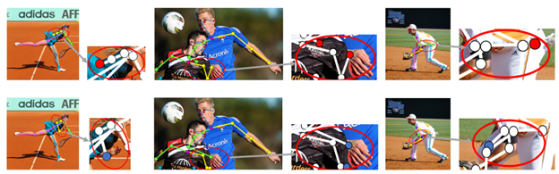

南方科技大学电子与电气工程系2021级专业硕士研究生阚哲涵在人体姿态估计领域提出了一种新型有效的自约束人体姿态估计方法，解决了人体姿态估计中的遮挡、泛化问题。
在国际计算机视觉三大顶级会议之一《European Conference on Computer Vision》（ECCV 2022）上发表研究成果，文章题目为《Self-Constrained Inference Optimization on Structural Groups for Human Pose Estimation》。

Figure 1. Illustration of the proposed idea of self-constrained inference optimization of structural groups for human pose estimation.

随着XR时代的到来，虚拟现实、人机交互、增强现实等技术逐渐成熟，作为XR研究中的核心问题，准确的人体姿态估计愈发重要。但极易发生的对象间的遮挡，背景、纹理变化导致的泛化问题成为了人体姿态估计任务中最难以解决的部分。

Figure 2. The overall framework of the proposed network.

文章开发了一个自约束的预测验证网络，以表征和学习训练过程中关键点之间的结构相关性。在推理阶段，来自验证网络的反馈信息能够进一步优化姿态预测结果，从而显著提高人体姿态估计的性能。本工作在公开数据集MS COCO 和 CrowdPose 上取得了显著的提升，为后续的研究提供了重要的参考启发价值。

Figure 3. Three examples of refinement of predicted keypoints. The top row is the original estimation. The bottom row is the refined version by the proposed method.

南科大2021级硕士研究生阚哲涵为本文第一作者，南科大2021级硕士研究生陈烁硕和统计系助理教授李曾为本文作者，电子系讲席教授何志海为本文通讯作者，南科大为论文第一单位。南科大2021级硕士研究生阚哲涵和陈烁硕同学均来自何志海课题组。  
论文链接: <a href=https://arxiv.org/abs/2207.02425>https://arxiv.org/abs/2207.02425</a> 
论文资助信息：李曾老师研究部分由国家自然科学基金No. 12031005和No. 12101292支持